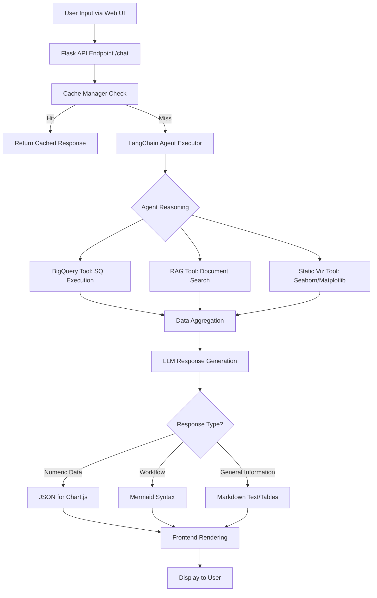
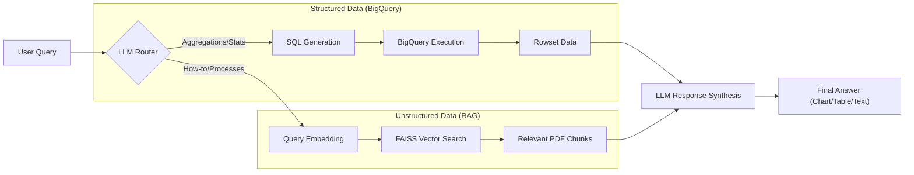

# Technical Documentation: Agency OS RAG Chat

This document provides a comprehensive overview of the technical architecture, technology stack, and implementation details of the Agency OS RAG Chat application.

## 1. Technology Stack

### Backend Architecture
- **Language:** Python 3.10+
- **Web Framework:** Flask
- **Environment Management:** `python-dotenv`
- **Asynchronous Processing:** Multi-threaded Flask development server

### Artificial Intelligence & LLM
- **Core Model:** Google Gemini 2.5 Flash
- **Embedding Model:** `models/embedding-001` (Google Generative AI Embeddings)
- **Orchestration Framework:** LangChain
  - `langchain-google-genai`: Direct integration with Google's Gemini models.
  - `langchain-core` & `langchain-community`: Core logic and community-provided tools.
  - `langchain-classic-agents`: Implementation of the ReAct agent pattern.

### Data & Storage
- **Structured Database:** Google BigQuery
  - **Dataset:** `hackathon_data`
  - **Project:** `expert-hackathon-2026`
- **Vector Database:** FAISS (Facebook AI Similarity Search)
  - Used for Retrieval Augmented Generation (RAG) over PDF documents.
- **Caching Layer:** SQLite
  - Caches agent invocations and tool outputs to reduce latency and API costs.
- **Reporting:** `pandas` and `openpyxl` for Excel/CSV data exports.

### Frontend (User Interface)
- **Design:** Modern Glassmorphism UI with a premium dark theme.
- **Core:** Semantic HTML5 and Vanilla CSS3.
- **Interactivity:**
  - **3D Visualization:** Three.js (Interactive 3D Globe with dynamic branch pins).
  - **Charts:** Chart.js (Dynamic, interactive charts rendered from LLM-generated JSON).
  - **Flowcharts:** Mermaid.js (Process and workflow diagram rendering).
  - **Markdown:** Marked.js (Full Markdown support for AI responses and tables).

---

## 2. Project Implementation Flow

The following flowchart illustrates the end-to-end request handling process:

### 2.1 RAG & BigQuery Logic Flow

The agent dynamically chooses between structured record retrieval (BigQuery) and unstructured document search (RAG) based on the user's intent.

---

## 3. Core Modules

### `app.py`
The central hub of the application. It handles routing, authentication (via BigQuery), chat history management, and the integration between the frontend and the LangChain agent.

### `agent_tools.py`
Defines the capabilities of the agent:
- `list_tables`: Introspects the BigQuery schema.
- `execute_sql`: Safely executes SQL queries against the Google Cloud project.
- `create_visualization`: Generates static images for simpler plotting requests.

### `document_rag.py`
Manages the RAG pipeline:
- PDF ingestion and text splitting.
- Vector store initialization (FAISS).
- Semantic search functionality using Google Embeddings.

### `cache_manager.py`
A robust caching utility using SQLite to store long-form AI responses, ensuring that repetitive queries are answered instantly without hitting the LLM API.

---

## 4. Database Schema (BigQuery)
The application primarily interacts with the following tables in the `hackathon_data` dataset:
- `application_table`
- `base_branch_table`
- `base_contact_table`
- `crm_user` (Authentication)
- `deals_applications_table`
- `enquiry_table`
- `office_visit_table`

---

## 5. Deployment
- **Containerization:** Docker & Docker Compose.
- **Public Access:** Integrated with `ngrok` for secure external tunneling during development.
